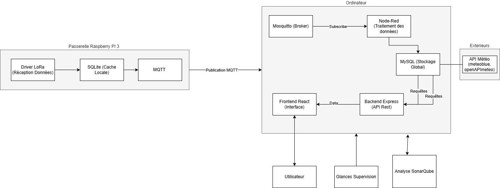
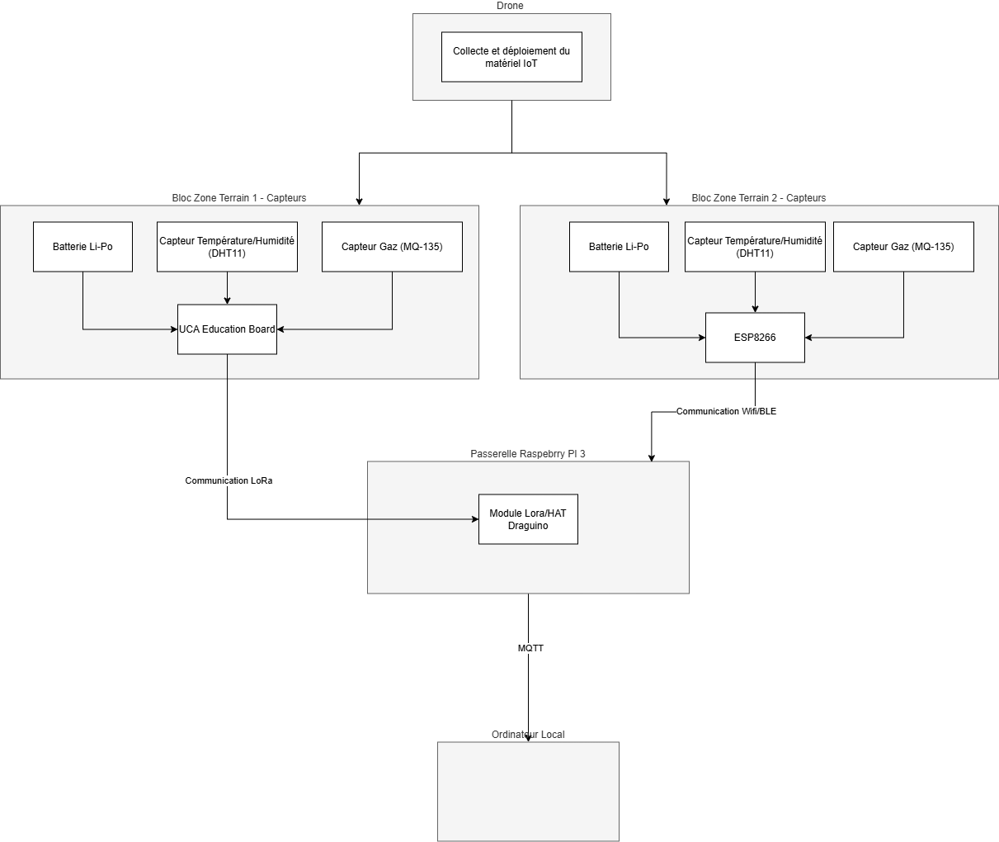

# Physis : Plateforme de Gestion des Risques IoT

Ce projet est une solution complète (Fullstack + IoT) permettant la surveillance de zones à risques (incendies, inondations, etc.) via des capteurs simulés et des données météorologiques en temps réel.

[](https://creativecommons.org/licenses/by-nc-sa/4.0/)

---

## Accès Rapides (Liens Utiles)

### Environnement de Production (Azure)
Version "live", déployée automatiquement via la branche `main`.
*Note : En production, les données capteurs peuvent être simulées via Node-RED directement sur le serveur, moquitto fonctionne également.*

| Service | URL | Description |
| :--- | :--- | :--- |
| **Site Web (Frontend)** | [http://20.250.161.72:8080](http://20.250.161.72:8080) | Interface utilisateur publique |
| **API (Backend)** | [http://20.250.161.72:3000](http://20.250.161.72:3000) | API REST |
| **Monitoring (Glances)** | [http://20.250.161.72:61208](http://20.250.161.72:61208) | Surveillance Serveur (CPU/RAM) |
| **Node-RED** | [http://20.250.161.72:1880](http://20.250.161.72:1880) | Flux IoT & Simulation |

> **Sécurité Node-RED** : L'accès à l'interface Node-RED est restreint. Si vous avez besoin d'y accéder, demandez les identifiants ou l'autorisation IP à Mathys.

### Environnement Local (Docker)
Accessible une fois `docker compose up` lancé sur votre machine.

| Service | URL | Identifiants par défaut |
| :--- | :--- | :--- |
| **Frontend** | [http://localhost:8080](http://localhost:8080) | - |
| **Backend API** | [http://localhost:3000](http://localhost:3000) | - |
| **Node-RED** | [http://localhost:1880](http://localhost:1880) | - |
| **SonarQube** | [http://localhost:9000](http://localhost:9000) | `admin` / `admin` |
| **Monitoring** | [http://localhost:61208](http://localhost:61208) | - |

---
## Architecture 
```bash
/ (Racine du projet)
├── backend/                  # API 
│   ├── server.js             # Point d'entrée & Logique métier
│   ├── server.test.js        # Tests unitaires jest
│   └── Dockerfile            # Image Docker Backend
│
├── frontend/                 # Application Vue.js
│   ├── src/                  # Composants et Vues
│   └── Dockerfile            # Image Docker Frontend
│
├── mosquitto-config/         # Configuration du Broker MQTT
│   └── mosquitto.conf        # Règles d'accès et persistance
│
├── mysql-init/               # Initialisation BDD
│   └── init.sql              # Script de création des tables
│
├── nginx/                    # Configuration load Balancing
│   └── nginx.conf
│
├── nodered/                  # build Node-RED
├── nodered-data/             # Volume persistant (flows.json)
│
├── docker-compose.yml          # Orchestration Développement (Local)
├── docker-compose.staging.yml  # Orchestration Production (Azure)
├── .gitlab-ci.yml              # Pipeline CI/CD
└── sonar-project.properties    # Configuration SonarQube (non utilisé)
```
## Architecture Logicielle
 
## Architecture Matérielle 

## Installation & Démarrage (Local)

### 1.Prérequis
* **Docker** et **Docker Compose** installés.
* **Node.js** (uniquement pour lancer les scripts de tests/scan).
* **Git**.
* **Docker Desktop** et il faut l'avoir démarré.


### 2.Configuration Initiale (Indispensable)
Pour que le frontend puisse communiquer avec le backend, vous devez créer un fichier d'environnement.

1.  Allez dans le dossier `frontend/`.
2.  Créez un fichier nommé `.env`.
3.  Ajoutez-y **une** des options suivantes :

```properties
# Option A : Utiliser les données du serveur Azure sans lancer le backend local
VITE_API_URL=http://20.250.161.72:3000

# Option B : Travailler 100% en local (Nécessite le backend Docker lancé)
VITE_API_URL=http://localhost:3000
```

### 3. Préparation pour Windows (WSL2)
**Critique pour SonarQube :** Elasticsearch nécessite plus de mémoire virtuelle que la configuration par défaut de WSL.
Ouvrez PowerShell en **Administrateur** et exécutez :
```powershell
wsl -d docker-desktop sysctl -w vm.max_map_count=262144
```

### 4. Lancement de l'application
À la racine du projet :
```bash
docker compose up --build
```
L'application est ensuite accessible sur [http://localhost:8080](http://localhost:8080).

---

## Qualité du Code & Tests

### Analyse Statique (SonarQube)
Le serveur SonarQube tourne localement via Docker.

**1. Configuration du Token (Premier lancement)**
Si c'est votre première utilisation ou après un reset :
1.  Connectez-vous sur [http://localhost:9000](http://localhost:9000) (`admin` / `admin`).
2.  Allez dans **My Account** > **Security**.
3.  Générez un nouveau token (Type: User Token).
4.  Mettez ce token dans le fichier `package.json` à la racine (scripts `scan`).

**2. Lancer l'analyse**
Une fois le conteneur actif, lancez dans un terminal :
* Windows : `npm run scan:win`
* Linux/Mac : `npm run scan:linux`

### Tests Unitaires (Backend)
Nous utilisons Jest pour valider le back (logique métier).

```bash
cd backend
npm install
npm test
```

---

## Architecture & Déploiement (CI/CD)

### Gestion Dynamique de l'API
On code pas d'IP en dur :
* **En Local :** Il utilise le fichier `.env`.
* **En Prod :** L'IP Azure est injectée automatiquement dans l'image Docker par GitLab CI au moment du build.

### Workflow Git
* **Branche `develop`** : Push = Tests + Build (Vérification). **Pas de déploiement.**
* **Branche `main`** : Push = Tests + Build + **Mise à jour automatique de la production (watchtower).**

---

## Maintenance & Commandes Avancées

**Réinitialiser totalement le projet (supprimer les données) :**
```bash
docker compose down -v
# Attention : Cela efface la BDD SonarQube, il faudra régénérer le token.
```

**Simuler une montée en charge (Load Balancing) :**
Lancer 3 instances du backend pour gérer plus de trafic :
```bash
docker compose up -d --scale backend=3
```

## Comment Contribuer (Workflow Git)
Nous utilisons une stratégie stricte pour garantir la stabilité de la production.

### Stratégie de Branches ###

**main** : Branche de production (Intouchable directement). Tout code ici est déployé sur Azure.

**develop** : Branche de pré-prod, elle contient l'application complète qu'on utilise en local et SonarQube.

**feature/nom-feature** : Pour ajouter une fonctionnalité (ex: feature/login-page).

**hotfix/nom-bug** : Pour corriger un bug (ex: hotfix/api-timeout).

### Procédure de Contribution ###

1. Cloner le projet.

2. Créer une branche depuis develop : git checkout -b feat/ma-feature.

3. Coder et tester intégralement en local, en supprimant les volumes et en vérifiant l'entièreté des fonctions.

4. Commiter avec des messages clairs : git commit -m "feat: ajout du graphique météo".

5. Pousser la branche : git push origin feature/ma-feature.

6. Ouvrir une Merge Request (MR) sur GitLab vers develop.

7. Attendre que le Pipeline CI (Tests détaillés ci-dessous) soit vert avant de fusionner.

## Tests sur la Pipeline CI

Notre pipeline GitLab CI est structuré en 3 étapes principales pour garantir la qualité et la sécurité avant tout déploiement.
Nous avons 7 jobs en tout :

**Stage Build**

build:frontend / build:backend / build:nodered : Compilation du code et construction des images Docker pour chaque service.

**Stage Test**

test:backend:unit : Tests unitaires du serveur (Jest) pour valider la logique métier.

test:frontend:unit : Tests des composants Vue.js pour vérifier l'interface.

**Stage Security** 

security:npm-audit : Analyse des dépendances (package.json) pour détecter des failles connues dans les librairies.

security:trivy : Scan des images Docker générées pour détecter des vulnérabilités critiques dans l'OS du conteneur (CVE).

## Justification des Choix Techniques

Conformément aux contraintes du projet, voici les motivations derrière nos choix technologiques :

### 1. Architecture Micro-services (Docker & Compose)
* **Pourquoi :** L'utilisation de **Docker** garantit l'isomorphisme entre le développement et la production sur Azure. Chaque composant (Front, Back, BDD, MQTT, Node-RED, Glances, SonarQube) est isolé, facilitant la maintenance et l'évolution indépendante des services.

### 2. Communication IoT (MQTT & Mosquitto)
* **Pourquoi :** Le protocole **MQTT** est le standard industriel de l'IoT en raison de sa légèreté. **Mosquitto** a été choisi pour sa très faible consommation de ressources sur le serveur Azure tout en gérant efficacement des centaines de messages par seconde.

### 3. Logique et Simulation (Node-RED)
* **Pourquoi :** **Node-RED** permet de prototyper rapidement des flux de données complexes (mélange de données capteurs et APIs météo externes) sans avoir à coder une infrastructure de traitement de flux lourde à partir de zéro.

### 4. Automatisation CI/CD (GitLab CI & Watchtower)
* **Pipeline :** GitLab automatise les tests unitaires et les scans de sécurité (**Trivy**) à chaque push.
* **Déploiement :** Nous utilisons **Watchtower** sur Azure pour un déploiement "Pull-based". Cela évite d'ouvrir des accès SSH risqués depuis GitLab ; le serveur se met à jour automatiquement dès qu'une nouvelle image est détectée sur DockerHub.

### 5. Qualité du Code (SonarQube)
* **Pourquoi :** L'analyse **SonarQube** est effectuée pour garantir un code propre et maintenable. Pour économiser les ressources (RAM) de l'instance Azure, nous privilégions une instance SonarQube locale ou via script pour valider le code avant le déploiement.

### 6. Monitoring (Glances)
* **Pourquoi :** Plutôt qu'une stack lourde (Prometheus/Grafana), **Glances** offre un monitoring temps réel (CPU, RAM, Docker) via une interface web ultra-légère, parfaitement adaptée à une instance cloud étudiante.
